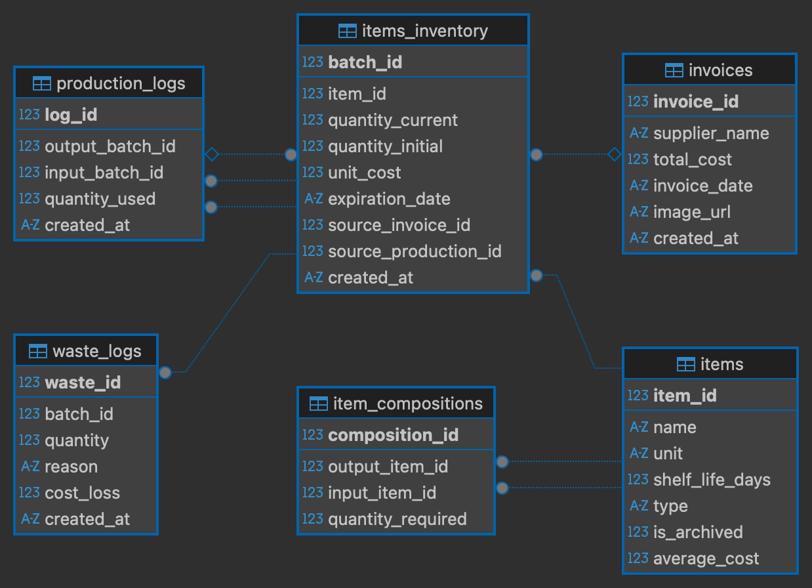

# YABA Backend

FastAPI server providing the REST API for the YABA Kitchen Management System. It handles inventory, production, recipes, costing, invoices, waste tracking, and demand forecasting.

---

## Tech Stack

| Component | Technology |
|---|---|
| Framework | FastAPI ≥ 0.104 |
| ASGI Server | Uvicorn ≥ 0.24 |
| Language | Python 3.12 |
| ORM | SQLAlchemy 2 (async) |
| Database | SQLite via aiosqlite |
| Validation | Pydantic ≥ 2.0 |
| Analytics | statsmodels ≥ 0.14, NumPy ≥ 1.26 |
| Testing | pytest, pytest-asyncio, httpx |

---

## Setup

```bash
cd backend

# Install dependencies
pip install -r requirements.txt

# Start the development server
uvicorn src.main:app --reload
```

The server starts at `http://localhost:8000`.

- **Swagger UI** — `http://localhost:8000/docs`
- **ReDoc** — `http://localhost:8000/redoc`
- **OpenAPI JSON** — `http://localhost:8000/openapi.json`

### Seed Demo Data

```bash
python scripts/seed_data.py
```

Creates 30 days of Italian-bistro sample data: items, invoices, production runs, and waste entries.

---

## Project Structure

```
backend/
├── src/
│   ├── main.py              # FastAPI app, lifespan, CORS, router registration
│   ├── database.py          # Async SQLAlchemy engine and session factory
│   ├── models.py            # ORM models (Item, Invoice, Inventory, etc.)
│   ├── schemas.py           # Pydantic request/response schemas
│   ├── routers/
│   │   ├── dashboard.py     # KPI stats and recent logs
│   │   ├── definitions.py   # Item and recipe CRUD
│   │   ├── forecasting.py   # Demand forecasting and reorder recommendations
│   │   ├── ingestion.py     # Invoice image upload and OCR processing
│   │   ├── inventory.py     # Stock summary, batches, waste, cost
│   │   ├── invoices.py      # Invoice list, manual creation, deletion
│   │   └── production.py    # Production recording and reverting
│   └── services/
│       ├── cost_service.py       # Recipe cost roll-up calculations
│       ├── forecasting_service.py # ARIMA/SARIMA demand prediction
│       ├── inventory_service.py  # FIFO deduction, batch management
│       ├── ocr_service.py        # Invoice image OCR parsing
│       ├── recipe_service.py     # Recipe composition lookup
│       └── unit_conversion.py    # Unit conversion utilities
├── tests/                   # pytest test suite (15+ files)
├── scripts/
│   └── seed_data.py         # Demo data generator
├── requirements.txt         # Python dependencies
└── pyproject.toml           # pytest configuration
```

---

## Database

YABA uses **SQLite** (async, via `aiosqlite`) for local development. The database file (`yaba.db`) is created automatically on first startup.

### Schema



#### Tables

| Table | Purpose | Key Columns |
|---|---|---|
| `items` | Product definitions | `item_id`, `name`, `unit`, `type` (Raw / Prepped / Dish), `shelf_life_days`, `average_cost`, `is_archived` |
| `item_compositions` | Recipe ingredients | `output_item_id`, `input_item_id`, `quantity_required` |
| `items_inventory` | Batch-level stock | `batch_id`, `item_id`, `quantity_current`, `quantity_initial`, `unit_cost`, `expiration_date`, `source_invoice_id`, `source_production_id` |
| `production_logs` | Production history | `log_id`, `output_batch_id`, `input_batch_id`, `quantity_used` |
| `invoices` | Supplier purchases | `invoice_id`, `supplier_name`, `total_cost`, `invoice_date`, `image_url` |
| `waste_logs` | Waste entries | `waste_id`, `batch_id`, `quantity`, `reason` (Spoiled / Dropped / Burned / Theft), `cost_loss` |

---

## API Reference

All endpoints return JSON. The base URL is `http://localhost:8000`.

### Dashboard — `/dashboard`

| Method | Endpoint | Description |
|---|---|---|
| GET | `/dashboard/stats` | Aggregated KPIs: low-stock count, daily production cost, pending invoices, weekly waste value |
| GET | `/dashboard/recent-logs` | Five most recent production logs with item names |

### Definitions — `/items`

| Method | Endpoint | Description |
|---|---|---|
| GET | `/items/` | List items (optional `?type=Raw\|Prepped\|Dish` filter) |
| POST | `/items/` | Create a new item |
| PUT | `/items/{item_id}` | Update item details |
| DELETE | `/items/{item_id}` | Archive (soft-delete) an item |
| GET | `/items/{item_id}/recipe` | Get full recipe tree for an item |
| POST | `/items/{item_id}/recipe` | Add a single recipe ingredient |
| POST | `/items/{item_id}/composition` | Replace the full recipe composition |

### Inventory — `/inventory`

| Method | Endpoint | Description |
|---|---|---|
| GET | `/inventory/summary` | Total stock per item with inventory value |
| GET | `/inventory/batches` | All active batches |
| GET | `/inventory/batches/{item_id}` | Batches for a specific item |
| PUT | `/inventory/batch/{batch_id}` | Manual batch quantity adjustment |
| GET | `/inventory/check-stock/{item_id}` | Check ingredient availability for production |
| GET | `/inventory/cost/{item_id}` | Calculate current item cost |
| POST | `/inventory/production/manual` | Manual production (deduct inputs, create output) |
| POST | `/inventory/deplete` | Log stock depletion (sales/POS orders) with quantity validation |
| POST | `/inventory/waste` | Log waste and record cost loss |

### Production — `/production`

| Method | Endpoint | Description |
|---|---|---|
| POST | `/production/record` | Record a production run (FIFO ingredient deduction) |
| POST | `/production/{log_id}/revert` | Revert a production run (restock ingredients, void output) |

### Invoices — `/invoices`

| Method | Endpoint | Description |
|---|---|---|
| GET | `/invoices/` | List all invoices |
| POST | `/invoices/manual` | Create manual invoice and auto-create inventory batches |
| POST | `/invoices/upload` | Upload invoice image for OCR processing |
| DELETE | `/invoices/{invoice_id}` | Delete invoice and revert inventory if unused |

### Forecasting — `/forecasting`

| Method | Endpoint | Description |
|---|---|---|
| GET | `/forecasting/reorder-recommendations` | Demand forecast with reorder suggestions (configurable 7–90 day horizon) |

---

## Services

| Service | Responsibility |
|---|---|
| `inventory_service` | FIFO batch deduction, production execution, batch creation |
| `cost_service` | Recursive recipe cost roll-up from ingredient unit costs |
| `forecasting_service` | ARIMA/SARIMA time-series demand prediction |
| `recipe_service` | Recipe composition lookup and validation |
| `unit_conversion` | Unit conversion between kg, g, liter, ml, etc. |

---

## Testing

```bash
# Full test suite
pytest -v

# Single file
pytest tests/test_inventory_service.py

# With coverage
pip install pytest-cov
pytest --cov=src
```

See [TESTING.md](../TESTING.md) for the complete test file map, manual QA checklist, and CI/CD workflow.
